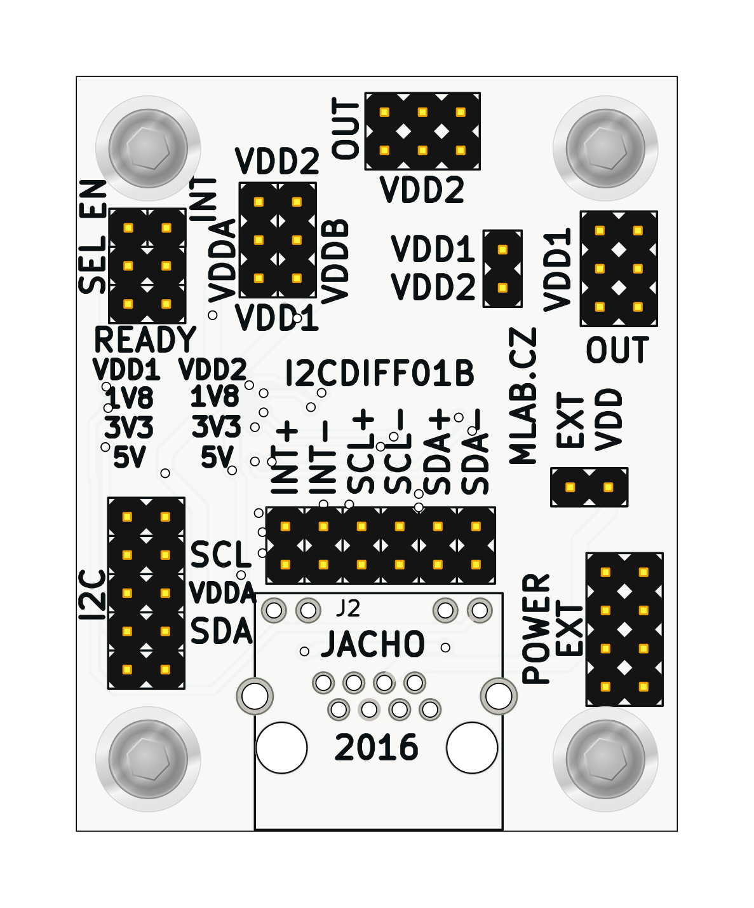

# I2CDIFF01 - Differential I²C Transceiver

Allows long-range I²C communication in harsh environments. In addition to I²C data transfer, the module supports bidirectional interrupt signaling over the same cable.

## Features

* Converts standard I²C signals to differential I²C for robust transmission
* Supports interrupt signal transmission
* Uses PCA9616 buffer for differential I²C communication
* Enables power transmission over RJ45 cable
* Configurable voltage levels using onboard jumpers
* Power regulation with onboard voltage regulators
* RJ45 (Ethernet) cable for differential connection (UTP cable compatible)

## Technical Specifications

| Parameter      | Value                 |
| -------------- | --------------------- |
| Supply Voltage | Up to 15 V            |
| Communication  | I²C, Differential I²C |
| Main IC        | PCA9616               |
| Dimensions     | 40.1 × 50.3 × 16 mm   |

## Power and Voltage Configuration

* **VDDA**: Voltage for single-ended I²C side (selectable 3.3 V or 5 V by jumper; replace regulator for other voltages)
* **VDDB**: Voltage for differential I²C side (recommended 5 V)
* Power is supplied via the RJ45 cable; only one module in the chain should provide power
* Optional jumper on EXT-VDD allows routing of input voltage to internal regulator if below 15 V

## Connector Use

* **RJ45 connector** used for differential I²C transmission and power
* Do not connect the RJ45 cable to standard Ethernet equipment

## Jumpers and Configuration

* Jumpers available to select voltage sources (VDD1 or VDD2) for VDDA and VDDB
* Recommended not to use the SEL jumper when VDDA > 2.2 V
* Voltage levels indicated on PCB; use permanent marker to label used levels

## Typical Use Cases

* Extending I²C bus over longer distances
* Connecting devices across electrically noisy environments
* Applications requiring shared interrupt signaling across modules

## Notes

* Ensure proper termination of differential pairs per PCA9616 datasheet
* Verify jumper settings and supply voltages before powering the module
* Do not mix power sources across RJ45-connected modules

